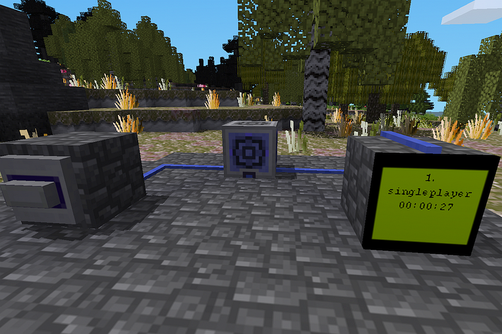

# g_runner_logic
 ## Runner Game Core Logic
 -------------

 This luanti/minetest mod adds the logic, nodes & chat-commands for a simple "running"-game.
 
 The goal of this game is to reach the goal-node and punch it.
 
 When you die, your time gets reset and you start a new run.
 
 Every time you reach the goal, you gain a rank and get a prize(prizes need to be configured by the admin).
 
 Your time is recorded in a Highscore-Table, so you can compete on the fastest time.
 
 -------------
 
 The mod provides 3 non-craftable blocks:
 
 + The Goal Block				-	punch it to end your run.
 + The Prize Chest				-	contains your prizes after you punched the Goal Block.
 + The Digiline Status Block	-	(with digiline-mod installed) returns the Name & Time of a Position in the Highscore-Table
 
 

--------------

The mod has 3 chat-commands for players & one for the admin.

Player-Commands:

+ /mystats 						-	Show your Rank, Best-Time & Last-Time 
+ /highscores					-	Show the Highscore-Table
+ /who							-	Show the Players currently online, their Rank & and Run-Status (if running or finnished)

Admin-Command:	(requires priv "prizemanage")

+ /prizemanage \<number\> | over	-	opens the prize-Inventory for a Rank or the "over"-inventory

Example Usage: `/prizemanage 1` , `/prizemanage 12` or `/prizemanage over`
 
A copy of every item in a prize-Inventory for a Rank will be given to the player when he reaches that Rank.

When there is no Rank-Inventory for a certain Rank, the player instead receives 2 random items from the "over"-inventory.

------------- 

Digiline Block Usage:

The Block reacts to 
+ GET \<number\>		-	where number is a Highscore-Position (e.g. `GET 1` for the first place) 

it will then respond with a string with `<Highscore-Position>. <Playername> <Best-Time>` or `0` if that position does not exist.

-------------

For this game-mode to make sense, it is required to:
+ disable teleport-commands for players
+ disable teleport to home
+ not have any Teleport-Devices readily availiable to the players

Suggested to use with this mod:
+ all interesting vehicle mods
+ all monster mods
+ any funny or dangerous biome
+ my own "respawn-kit"-mod